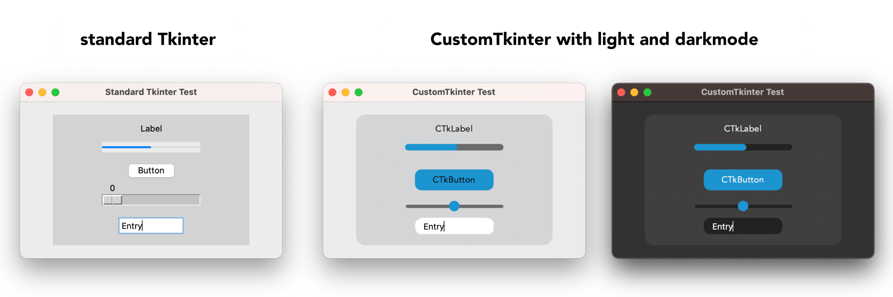
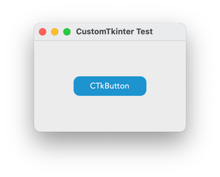
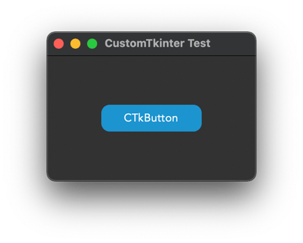
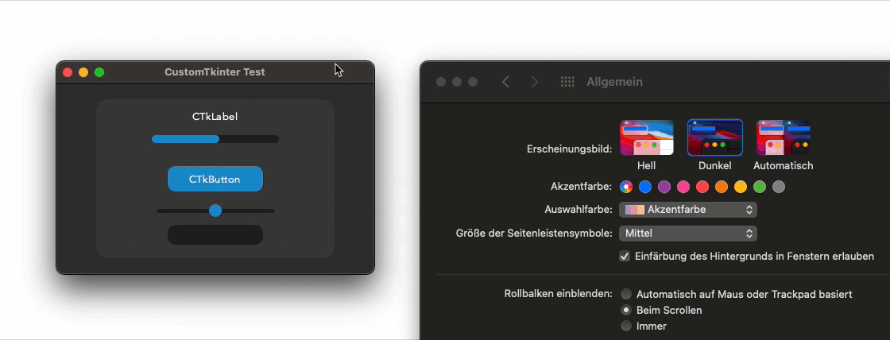
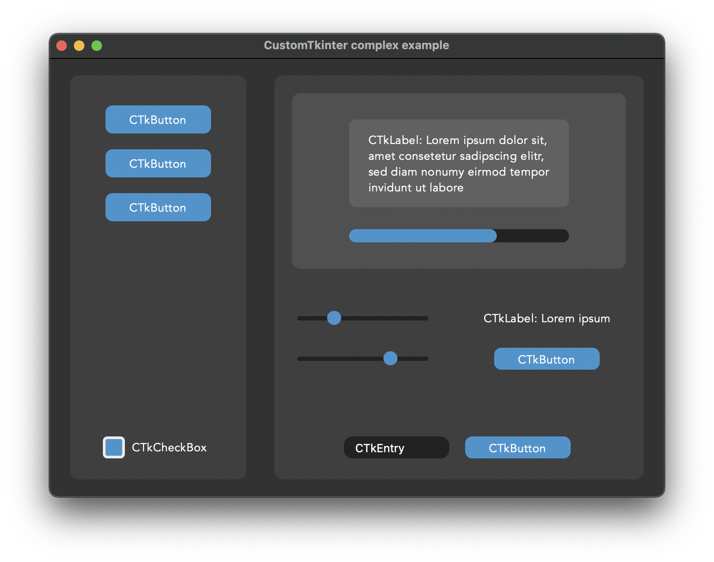
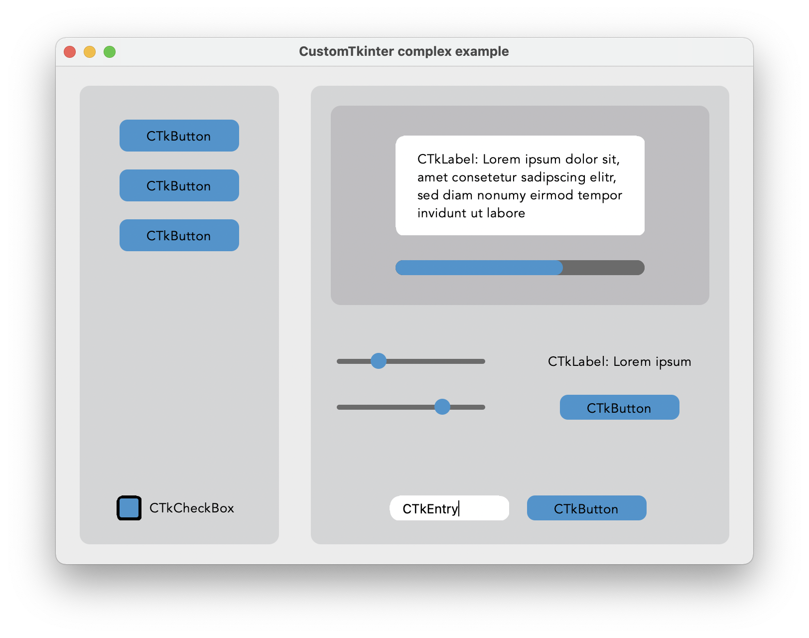
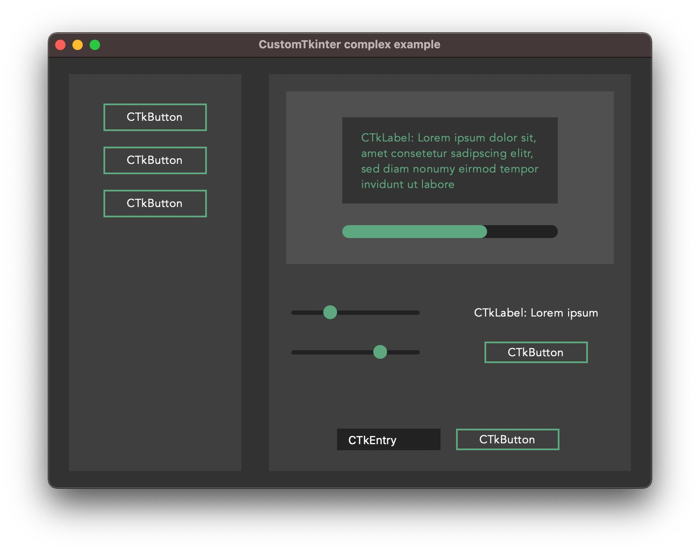
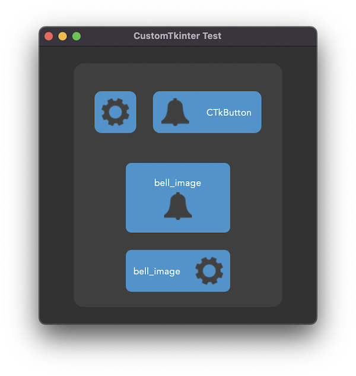

# CustomTkinter


With CustomTkinter you can create modern looking user
interfaces in python with tkinter. CustomTkinter is a
tkinter extension which provides extra ui-elements like
the CTkButton, which can be used like a normal tkinter.Button,
but can be customized with a border and round edges.

CustomTkinter also supports a light and dark theme,
which can either be set manually or get controlled by
the system appearance mode (only macOS).

### Installation

To use CustomTkinter, just place the /customtkinter folder from this repository
next to your program, or **install the module with pip**:

```
pip install customtkinter
```
PyPI: https://pypi.org/project/customtkinter/

### Example program (simple button):
To test customtkinter you can try this simple example with only a single button:
```python
import tkinter
import customtkinter  # <- import the CustomTkinter module

root_tk = tkinter.Tk()  # create the Tk window like you normally do
root_tk.geometry("400x240")
root_tk.title("CustomTkinter Test")

def button_function():
    print("button pressed")

# Use CTkButton instead of tkinter Button
button = customtkinter.CTkButton(master=root_tk, corner_radius=10, command=button_function)
button.place(relx=0.5, rely=0.5, anchor=tkinter.CENTER)

root_tk.mainloop()
```
which gives the following:



### Use custom colors and shapes:
If you dont specify any colors, customtkinter uses the standard blue color in the light theme.
You can change the color theme to dark by calling
```customtkinter.set_appearance_mode("Dark")```.
If you specify custom colors for CustomTkinter elements, the you can either use a
tuple in the form: (light_color, dark_color). Or you can set a single color
which will be used in light and dark theme.
```python
customtkinter.set_appearance_mode("Dark") # Other: "Light", "System" (only macOS)

button = customtkinter.CTkButton(master=root_tk,
                                 fg_color=("black", "lightgray"),  # <- tuple color for light and dark theme
                                 text="CTkButton",
                                 command=button_event)
button.place(relx=0.5, rely=0.5, anchor=tkinter.CENTER)
```

### How to use macOS dark mode?
If you have a python version with Tcl/Tk >= 8.6.9, then you can enable the macOS
darkmode. Currently only the anaconda python versions have Tcl/Tk >= 8.6.9.
So if you want a dark window titlebar, you have to install anaconda python version
or miniconda.
```python
import tkinter
import customtkinter

customtkinter.enable_macos_darkmode()
customtkinter.set_appearance_mode("System")

... the program ...

customtkinter.disable_macos_darkmode()
```
which gives the following with the above simple button program:



If you set the appearance mode to "System", it should change with
the System mode:



### Advanced example with multiple CTkFrames

Here I used the ``customtkinter.enable_macos_darkmode()`` command to
enable the macOS darkmode, and used multpiple CTkFrames. It has some
kind of a menu on the left side, and I used all CustomTkinter elements
there are at the moment.Maybe this is a good reference if you want to
create your own application with this library.
(Code: /complex_example.py) 

With macOS darkmode turned on, it looks like this:



Otherwise it looks like this:



But can also customize it by yourself. Here I changed the main
colors and removed the round corners, and added a border to the buttons:



### CTkButton with images
It's also possible to put an image on a CTkButton. You just have to
pass a PhotoImage object to the CTkButton with the argument ``image``.
You can find an example program ( /simple_test_images.py ), where I
created two buttons with a bell and a settings image on them:




## Documentation - CustomTkinter Elements

### CTkButton
Examle Code:
```python
def button_event():
    print("button pressed")

button = customtkinter.CTkButton(master=root_tk,
                                 text="CTkButton",
                                 command=button_event,
                                 width=120,
                                 height=32,
                                 border_width=0,
                                 corner_radius=8)
button.place(relx=0.5, rely=0.5, anchor=tkinter.CENTER)
```
<details>
<summary>Show all arguments:</summary>

argument | value
--- | ---
master | root, tkinter.Frame or CTkFrame
text | string
command | callback function
width | button width in px
height | button height in px
corner_radius | corner radius in px
border_width | button border width in px
fg_color | forground color, tuple: (light_color, dark_color) or single color
bg_color | background color, tuple: (light_color, dark_color) or single color
border_color | border color, tuple: (light_color, dark_color) or single color
hover_color | hover color, tuple: (light_color, dark_color) or single color
text_color | text color, tuple: (light_color, dark_color) or single color
text_font | button text font, tuple: (font_name, size)
hover | enable/disable hover effect: True, False
image | put an image on the button, removes the text, must be class PhotoImage

CTkButton Methods:
```python
CTkButton.set_text(new_text)
CTkButton.change_image(new_image)
CTkButton.configure_color(bg_color=new_bg_color,
                          fg_color=new_fg_color,
                          hover_color=new_hover_color,
                          text_color=new_text_color)
```

</details>

### CTkLabel
Example Code:
```python
label = customtkinter.CTkLabel(master=root_tk,
                               text="CTkLabel",
                               width=120,
                               height=25,
                               corner_radius=8)
label.place(relx=0.5, rely=0.5, anchor=tkinter.CENTER)
```
<details>
<summary>Show all arguments:</summary>

argument | value
--- | ---
master | root, tkinter.Frame or CTkFrame
text | string
width | label width in px
height | label height in px
corner_radius | corner radius in px
fg_color | forground color, tuple: (light_color, dark_color) or single color
bg_color | background color, tuple: (light_color, dark_color) or single color
text_color | label text color, tuple: (light_color, dark_color) or single color
text_font | label text font, tuple: (font_name, size)
</details>

### CTkEntry
Example Code:
```python
entry = customtkinter.CTkEntry(master=root_tk,
                               width=120,
                               height=25,
                               corner_radius=10)
entry.place(relx=0.5, rely=0.5, anchor=tkinter.CENTER)

text = entry.get()
```
<details>
<summary>Show all arguments:</summary>

argument | value
--- | ---
master | root, tkinter.Frame or CTkFrame
width | entry width in px
height | entry height in px
corner_radius | corner radius in px
fg_color | forground color, tuple: (light_color, dark_color) or single color
bg_color | background color, tuple: (light_color, dark_color) or single color
text_color | entry text color, tuple: (light_color, dark_color) or single color
text_font | entry text font, tuple: (font_name, size)
</details>

### CTkSlider
Example Code:
```python
def slider_event(value):
    print(value)

slider = customtkinter.CTkSlider(master=root_tk,
                                 width=160,
                                 height=16,
                                 border_width=5.5,
                                 command=slider_event)
slider.place(relx=0.5, rely=0.5, anchor=tkinter.CENTER)
```
<details>
<summary>Show all arguments:</summary>

argument | value
--- | ---
master | root, tkinter.Frame or CTkFrame
command | callback function, gest called when slider gets changed
width | slider width in px
height | slider height in px
border_width | space around the slider rail in px
fg_color | forground color, tuple: (light_color, dark_color) or single color
bg_color | background color, tuple: (light_color, dark_color) or single color
border_color | slider border color, normally transparent (None)
button_color | color of the slider button, tuple: (light_color, dark_color) or single color
button_hover_color | hover color, tuple: (light_color, dark_color) or single color
</details>

### CTkProgressBar
Example Code:
```python
progressbar = customtkinter.CTkProgressBar(master=root_tk,
                                           width=160,
                                           height=20,
                                           border_width=5)
progressbar.place(relx=0.5, rely=0.5, anchor=tkinter.CENTER)

progressbar.set(value)
```
<details>
<summary>Show all arguments:</summary>

argument | value
--- | ---
master | root, tkinter.Frame or CTkFrame
width | slider width in px
height | slider height in px
border_width | border width in px
fg_color | forground color, tuple: (light_color, dark_color) or single color
bg_color | background color, tuple: (light_color, dark_color) or single color
border_color | slider border color, tuple: (light_color, dark_color) or single color
progress_color | progress color, tuple: (light_color, dark_color) or single color
</details>

### CTkFrame
Example Code:
```python
frame = customtkinter.CTkFrame(master=root_tk,
                               width=200,
                               height=200,
                               corner_radius=10)
frame.place(relx=0.5, rely=0.5, anchor=tkinter.CENTER)
```
<details>
<summary>Show all arguments:</summary>

argument | value
--- | ---
master | root, tkinter.Frame or CTkFrame
width | slider width in px
height | slider height in px
fg_color | forground color, tuple: (light_color, dark_color) or single color
bg_color | background color, tuple: (light_color, dark_color) or single color
</details>

### Special commands
Change appearance mode:
```python
customtkinter.set_appearance_mode("Light")
customtkinter.set_appearance_mode("Dark")
customtkinter.set_appearance_mode("System")  # macOS only

print(customtkinter.get_appearance_mode())
```

Use macOS darkmode window style:
```python
customtkinter.enable_macos_darkmode()  # get darkmode window style
customtkinter.disable_macos_darkmode()  # disable darkmode (important!)
```

If you dont use ``root_tk.mainloop()``, then you have to deactivate
the threaded search for a change of the system appearance mode, and
do it yourself in your main loop where you call ``root_tk.update()``.
```python
customtkinter.deactivate_threading()  # call this at the beginning
customtkinter.update_appearance_mode()  # then call this in the loop
```
